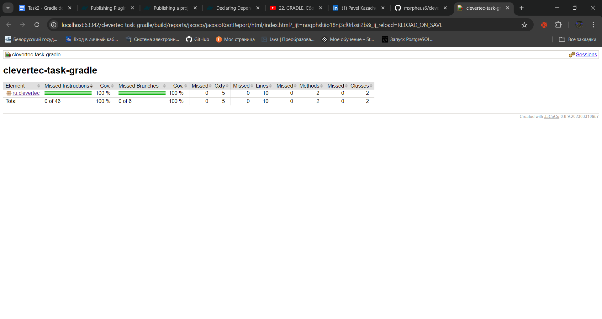
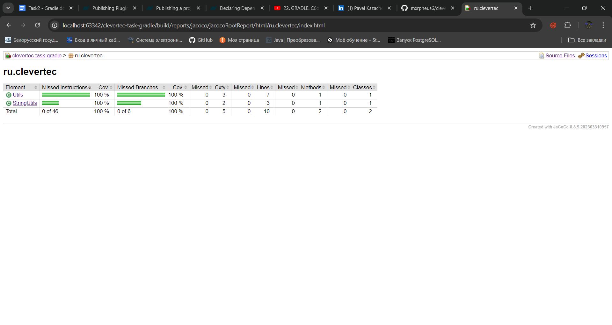

# Задание: Создание мульти-модульного проекта с кастомным Gradle плагином

## Описание

1. **Создание Gradle плагина**:
    - Плагин реализован в модуле buildSrc
    - Плагин подключен через `build.gradle` с помощью `id 'ru.clevertec.jacoco-root-report'`.

2. **Модуль `core`**:
    - В модуле `core` создайте класс `Utils` с методом `boolean isAllPositiveNumbers(String… str)`.
    - Используйте библиотеку `utils-1.3.5.jar`, созданную на предыдущих этапах, чтобы переиспользовать метод `boolean isPositiveNumber(String str)` в классе `Utils`.

3. **Структура проекта**:
    - Модуль `core` зависит от библиотеки `utils-1.3.5.jar`, которая находится в папке libs.
    - Метод `isAllPositiveNumbers` использует метод `isPositiveNumber` из `utils-1.3.5.jar`.

4. **Запуск проекта**:
    - Класс `App` содержит main. Запуск производится через этот класс
    - Чтобы провести тестрование с помошью Jacoco, нужно вызвать команду `./gradlew jacocoRootReport`

## Демонстрация Jacoco

